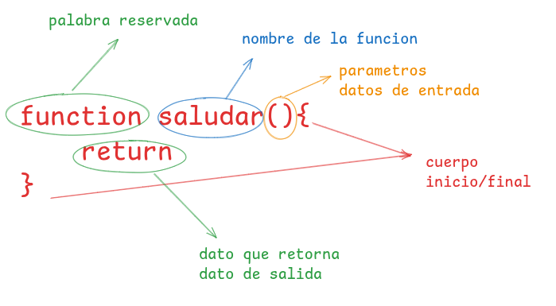

# TALLER DE REPASO DE JAVASCRIP
  > [!WARNING]
  obserbacion: Quokka se debe ejecutar en cada archivo
  >[!TIP]
  quokka detecta que en nuestro proyecto tenemos nodejs y lo ejecuta para poder la consola en vivo
## 1. tipos de datos
en java scrip se clasifican en dos grandes grupos 
[!TIP] javascript tiene funciones predeterminadas por ejemplo para mostrar un mensaje por consola `console.log()`, para poder vereficar que tipo de dato estamos manejando en java scrip tambien tenemos una funcion por defecto llamada typeof()
### primitivos

son datos que siempre exisitiran 
1. numericos
    - enteros positivos
    - enteros negativos 
    - decimal positivo
    - decimal neagativo
    - NaN (not a number)
2. texto
    - caracteres                 -   10001001 - 97 - A
    - simbolos especiales    - 01001001 010100101 -256 - @
    - string 
3. booleanos 
    - true   - 1
    - false  - 0
### estructurados
1. Array (lista)
   - array de tipo numerico
   - array de tipo string
   - arrar de tipo mixto
 - como esta estructuradi una array en javasript
2. objetos (diccionariio)
   son simoilares a ñas listas con la unica diferencia que en vez de tener valor e indice sus elemtos trabajan con clave.valor
- como esta estructurado un objeto en javascript
  ![alt text] 
## 2. variables (enlaces, binding)
es la tecnica que se usa para poder apuntar a una direcccion en memoria y al valor o dato relacionado o que se encuentre almacenado en ese momento
tenemos dos pasos para crear una variable/constante
1. primero declarar la variable/constante
2. segun inicializar la variable/constante
**OBSERVACION** para crear una variable primero tenemos que crear un enlace luego darle el nombre de la variable/constante:para las variables tenemos las palabras reservadas ` keyword `-`let`-`var` pra las constantes tenemos la palabra resrvada `keyword`- `const`
**RECOMENDACIONES** 
`Led` usar cuado el valor tendra que variar 
`const` usar cuando el valor sera el mismo siempre 
`var` evitar usar
`let`,`var` ambos nos permiten crear variables su unica diferencia es el alcanse ambito o `scope`
(averiguar)
## 3. operadores
su clasificacion general se divide en 3 
1. operadores promarios 
 son aquellos que estan ubicados a la izquierda del valor y que retornan en nuevo valor.
2. operadores binarios
   son aquellos que estan en medio de dos valores y que retornan un unico valor 
   - operadores de comparacion
   - operadores aritmeticos
   - operadores logicos
3. operadores terciarios
   son aquellos que evaluan tres valores y que retornan un solo valor 
   - operador condicional
## 4. controles de flujo
Nuestros programas en javascrip contienen mas de una sentencia y las sentencias son ejecutadas una a una como si fuera una historia, de arriba hacia abajo como un camino recto.

### 1. control de decicione (if-else)
javascrip nos permite crear caminos alternativos en nuestros programas dependiendo de una decision a esto se le conoce como caminos o ejecucion condicional. que ejecutara una sentencia u otros teniendo en cuenta la condicion asi podemos crear multiples caminos u opciones en nuestro programas
si tenemos una condicion verdadera se ejecutara una sentencia totalmente distinta.
**observacion** la ejecucion condicional rompe el flujo normal de un programa 
### 2. bucles (for)
- tarea con susu ejemplos 
  
### 3. bucles (while)
- tarea con sus ejemplos
  
  while (condición) {
  // código a ejecutar mientras la condición sea verdadera
}
## 5. funciones 
las funciones en javascripson bloques de codigo que se ejecuta de manera independiente, podemos decir tambien que son mini programs que toman datos como entrada y retornan otros datos como salida. 
las funciones son fundamentales para el correcto ordenamiento de nuestro codigo ademas que nos permiten separa de una manera mas ordenada nuestra logica y evitar repetir el codigo muchas veces.
existen 3 tipos de funciones 
### tipos de funciones 
#### 1. funciones por declaracion
este tipo de funciones es la mas conocida y la mas usada y su estructura es la siguiente:

#### 2 funciones por exprecion 
Función para calcular el cuadrado de un número
`js
const cuadrado = function(num) {
  return num * num;
};
`

 Función para calcular el cubo de un número
 `js
const cubo = function(num) {
  return num * num * num;
};
`
 Uso de las funciones
 `js
let numero = 3;
console.log("El cuadrado de", numero, "es:", cuadrado(numero)); // 9
console.log("El cubo de", numero, "es:", cubo(numero));       // 27
`
#### 3 funcion flecha (arrow punction)
1. Función flecha para sumar dos números
`js
const sumar = (a, b) => a + b;
`
 2. Función flecha para verificar si un número es par
 `js
const esPar = num => num % 2 === 0;
`
3. Función flecha para convertir una cadena a mayúsculas
 `js
const convertirMayusculas = texto => texto.toUpperCase();
`
Uso de las funciones
`js
console.log(sumar(5, 7));                  // 12
console.log(esPar(10));                     // true
console.log(convertirMayusculas("hola"));  // HOLA

## 6. metodos para trabajar con datos estructurados 
los metodos son funciones que dan funcionalidades extras a los tipos de datros en los cuales se aplican. es un metodo es antesecido por un tipo de dato y un punto.
**ejemplo**
el ejemplo mas claro de un metodo es el ´length´ - estrte metodo nos permite o nos retorno la cantidad de caracteres de un string o la cantidad de elementos de una lista.
```js
"hola".length // 4 
[2,5,4,6,7]. length // 5  
```
> [!TIP] los metodos en su mayoria solo se aplican a tipo de datos estring, listas y objetos, en su gran parte son aplicados para la lista.
### 6.1 metodos para estring - cadenas de texto 
#### length
devuelve la longitud de una cadena 
```js
let mensaje="hola como estas"
console.long(mensaje.lenhth)
//retorna -> 15
```
#### toLowerCase
devuelve una cadena en minusculas
```js
let mensaje="HOLA"
console.long(texto.toLowerCase())
//retorna -> hola
```
#### toUpperCase
devuelve una cadena en mayusculas
```js
let mensaje="hola"
console.long(texto.toUpperCase())
//retorna -> HOLA
```
#### concat
combina el texto de dos o mas cadenas 
```js
let nombre="kcapa"
let saludo="hola"
//let concatenado=nombre+saludo
console.long(saludo.concat(nombre))

let cad1="oh"
let cad2="me"
let cad3="vengo"
console.long(cad1.concat(cad2,cad3))
// retorna -> ho me vengo
```
#### trim
este metodo elimina los espacios que existen al inicio o final de una cadena  o texto 
```js 
let texto="   hola"
let nuevotexto.trim() //hola
let otrotexto="hola   "
let nuevootrotexto=otrotexto.trim() //hola
```
#### slice
este metodo permite extraer parte de una cadena, especificando sus indices, donde comenzar y hasta donde mostrar
```js
let parrafo="hola soy henrry"
//solo quiero que me muestre henrry
parrafo.slice(9) // henrry
parrafo.slice(5.8)
```
#### split 
este metodo retorna una lista basandoce en un separador que se le indique 
```js
let parrafo="solo se que nada se"
parrafo.split("") //["solo","se","que","nada","se"]
let url="google.com/search?=gatitos"
let gatito=url.split("=") //["google.com/search?","gatitos"]
console.log(gatito[1]) //gatitos
let listafrutas="manzana,tomate,pera,naranja"
listafrutas.split(",")

```

### 6.2 metodos para listas - arrays 
#### crear una lista 
```js
let lista=[]
```
#### Agregando elementos a una lista 
```js
lista[0]="manzana"
```
#### Agregando elementos al final de una lista 
```js
let lista=[]
lista.push("manzana")
```
#### Agregando elementos al inicio de una lista 
el metodo `unshift` agrega elemtos al inicio de una lista 
```js
let amigos=[`rony`,`lisbet`,`josema`]
amigos.unshift(ashly)

```
#### removiendo elemtos de una lista 
el metodo `pop` al contrario de push extrae el ultimo elemto de una lista.
#### shift
el metodo `shift` al contrario de unshift extrae el primer elemento de una lista.
#### Eliminando elemtos de una lizta 
#### delete
elimina un elemto de la base de su indice
```js
let texto=["hola","como"," ", "estas"]
delete texto[2]
```
#### splice 
este metodo elimina el elemento en base a su indice y a la cantidad de elemtos a eliminar.
```js
let vocales=[`a`,`e`,`e`,`i`,`o`,`u`]
vocales.splice(2,1)
```
#### combinando o uniendo listas (array)
#### concat
este metodo crea un nuevo array que contiene los elememtos de array original seguido por los elemtos de uno o mas array proporcionados.
```js
let friends=[]
let amigosprimaria=["choco","manuel","parra"]
let amigossecundaria=["jhon","jose","henrry"]
let amigossuperior=["ashly","lizbeth","ronny"]
let friends.amigosprimaria.concat(amigossecundaria,amigossuperior) 
```
#### metodos para iterar una lista 
#### forEach
este metodo ejecutrta una funcion anonima por cada elemento de una array 
```js
let numeros=[1,2,3,4,5,6]
numeros.forEach(n=>{console.log(n+1)})
```
#### map
este metodo ejecuta una funcion anonima por cada elemento de un array generando una nueva lista 
```js
let numeros=[1,2,3,4,5,6]
numeros.map(n=>{return n+1})
```
#### metodos para buscar elemtos en una lista 
#### includes 
este metoddo busca un valor en especifico y devuelve un valor booleano en cas de encontrar el valor buscando retorna true caso contrario false 
```js
let vocales=[`a`,`i`,`o`,`u`]
let buscaE=vocales.includes(`e`)
//retorna false
let buscaA=vocales.includes(`a`)
// retorna true 
```
#### filter
este metodo se usa para encontrar elementos dentro de una lista que cumplan con cierta condicion 
```js
let numeros=[2,4,6,8,1,2,6]
// deseo una lista con los numero que sena menor a 4

```
#### find
este metodo se usa para encontrar el primerelemento que cumpla con cierta condicion, a diferencia del `filter` solo retorna un elemto el que coincida con la condicion 
```js
let lisNumeros =[10,11,3,20,5]
led menorDiez=lisNumero.find(n=>{return n>10})
console.log(menorDiez)
```
### 6.3 metodos para objetos 
#### creando un objeto
```js
//objeto o diccionario vacio
led objeto={}
```
#### agregandos elementos a un objeto
recuerden que un objeto de un elemento conformado por `clave:valor`
```js
objeto["nombre"]="ruth"
objeto["edad"]="18"
objeto["cui"]="086745323"
```
#### Actualizando elementos de nuestro objeto
para realixart la actualizacion del valor de un elemto tenemos que acceder a travez de su clave y asignarle el nuevo valor **observacion** la clave debe ser la misma a actualizart de no existir creara una nueva 
```js
objeto["edad"]=20
```
#### Eliminare un elemto de nuestro objeto 
para eliminar un elemento de un objeto hacemos uso de un operador unario `delete` 
```js
delete objeto.CUI
```
## 7. es6
### arrow function
este es una tecnica para el desempaquetado de listas u objetos en variables esta tecnica facilita el acceso a los elementos de una lista u objetos 
```js
let  alumno={
  "nombre":"miguel",
  "edad":"17"
  console.log(alumno.nombre)
  // "miguel"
  console.log(alumno["edad"])
  //"17"
  // desestructuracion
  let {nombre,edad}=alumno
  
}
```
## 8. DOM (Document Objec Model)
- segun sus siglas es modelo de objeto de documeto 
- para web es una API del navegador, eso significa que nos proporciona una interfaz para cominucarnos entre html y javascript
- segun su funcionalidad DOM es el encargado de convertir documentos `html`y`css` en objetos de `javascript`, o en un arbol de objetos 
 - para `javascript` es el `DOM` es un objeto con el que podemos leer y modificar a nuestro antojo.

- la manera como `DOM` nos permite interactuar con nuestros documentos `html` y `css` son atravez de `selctores` 


### selectores 
 es la manera de como podemos manipular el `DOM`, este es el primer caso que debo dominar para realizar operaione de lectura o modificaciones.
###captura de elementos
### selectores tradicionales 
 estos selectores son metodos de documentos, por que `DOM` trabaja com el documento.
```js
//selectores po ID 
document.getElemetById("mi_div")
//<section Id="mi_vida"></section>
//--selectores por su atributo name
//<input name="dni" value"34567">
// dni="34567" 
document.get.ElementByName("dni")
document.setElementTagName("section")
//<h1></h1>
document.getElementBytagName("h1")
//---selectores por su clase
//<div class=rojo></div> 
document.getElementByClassName("rojo")


```
> [TIP] en la programacion web `DAW` se hace uso de dos tecnicas, 1. obtencion de datos (get), 2. creacion de datos (set)

##### selectores modernos o avanzados 
```js
// para la captura de un elemento, o el primer elemento que coincida con la busqueda 
document.querySelector()
// busca y obtiene el elemento que coincida con el nombre de la clase
document.querySelector(".nombre_clase")
// busca y obtiene el elemento que coincida con el nombre del id
document.querySelector("#nombre.id")
// busca y obtiene el elemento que coincida con el nombre de la etiqueta
document.querySelector("p")
document.queryselector(".input[name="dni"]")

// para accerder a todas las concidencias 
//esto retorna un array con todas las coincidencias
document.querySelectorAll(".nombre_clase")
```
#### acceder a contenido y actualizar contenido

una vex capturada el elmento con `querySelector` pueden hacer uso de `textContent` para accerder al contenido del elemto, de esta misma forma podemos editar o actualizart el contenido `textConten="hola"`
 esto lo que es actualizar el contenido anterior con el contemido que se esta asignando `textContent` solo se usa si desemos agregar contenido de tipo`html` se debeera usar `innerHTML`
 ```js
//<p id="text">este es un contenido</p>
let etiquetaP=document.querySelector("#text")
console.log(etiquetaP.textContent)
//este es un contenido
etiquetaP.textContent="nuevo texto"
console.log(etiquetaP.textContent)
// nuevo texto

//<div id="contenedor"></div>
let div=document.querySelector("#contenedor")
div.innerHTML=<p> este es un parrafo</p> 
 ```
 una ve ya conocido la forma de capturar elementos `HTML` y la forma de setear contenido(`textContent`) y (`innerhtml`), tambien podemos setar atributos y  removerlos.
 ```js
// <div id="contenido">contenido</div>
//data-description
let contenido=document.querySlector("#contenido")
// entre parentesis van dos parametros primero nombre del atributo a crear y sengundo el valor que debe tener
contenido.setAttribute("data-descrption","valor de mi adat-description")
//<div id="contenido" data-description="valor de mi data-description">contenido</div>

//eliminar el atributo creado
// entre parentesis el nombre del atributo que se va a eliminar 
contenido.removeAttribute("dat-description")
 ```
 ####  agreagr y eliminar elementos 
 para crear nuevo elemento no necesitamos captrar un elemto por que creamos un nuevo elemento 
```js
let nuevoEtiquetaP=document.createElement("P")
// agregar contenido a mi nueva etiqueta 
nuevoEtiquetaP.textContent="informacion de parrafo"

// para que esta informacion aparesca de manera visible en mi HTML debemos agregarle un elemento padre
/*
<body>
</body>
*/
let body=document.querySelector("body")
// hacer uso del elemto que me permite asignarle nuevos hijos 
body.appendChild(nuevoEtiquetaP)

// deseo eliminar ese elemeto que acabo de crear 
// pasamos el nombre del elemento a eliminar y luego usamos el metodo remove()
nuevoEtiquetaP.remove()

```